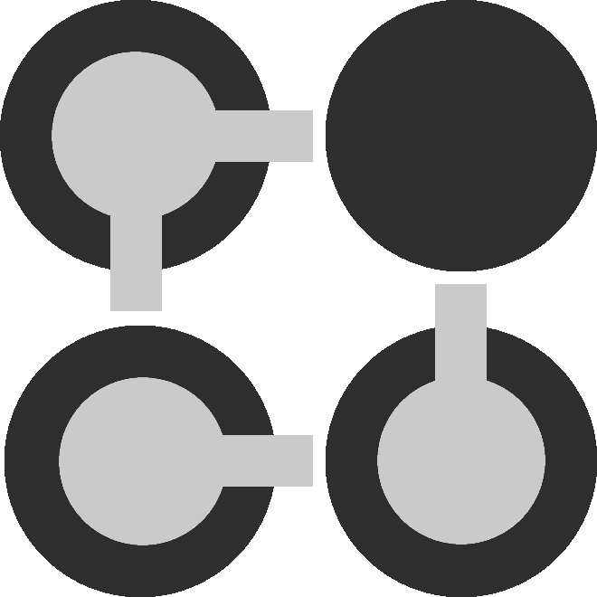

    
<h1 align="center">
    Abax Protocol
</h1>
This repository contains source code for Abax Protocol smart contracts as well as set of test suites and utilities scripts.

## Project structure

- `src` - contains sources of Abax Protocol's core contracts
- `tests` - contains e2e tests as well as utilities used for writing/running tests
- `scripts` - contains code for benchmarking contracts and initial deployment scripts

## Contracts build and deployment

### Prerequisites

- To build Abax Protocol you need to have prepared rust environment, with cargo-contract compatible with ink! 4.x .
  Follow official guides on how to set up/migrate to the environment that supports ink! 4.x:
- https://use.ink/faq/migrating-from-ink-3-to-4/#compatibility
- https://use.ink/getting-started/setup

- To run tests and use convenience scripts you have to run `yarn`/`yarn install` command to install required npm packages.

**Note**: Most of the node scripts will display much more information if you set an environment variable `DEBUG` (eg. `env DEBUG=1 yarn test`).

### Build

We've prepared some convenience scripts that somehow simplify the build process and streamline it to be usable from the root repo's directory.

- `yarn build` - allows you to build all contracts contained in the `src` folder, have the artifacts copied over to the `artifacts` folder, generate typechain types and measure the amount of time the build took. In addition `build.log`/`build.log.html` are created with the details of the build process - useful since the console output of `cargo contract build` for all contracts is lenghty.
  For preview we recommend to use either browser (`build.log.html`) or [`ANSI Colors`](https://marketplace.visualstudio.com/items?itemName=iliazeus.vscode-ansi) (`build.log`)
- `yarn cs <contract_name>` - allows you to build single contract and have its artifacts copied over to the `artifacts` folder.

### Deployment

Currently, only test deployment, onto local chain is supported by scripts - currently [version v0.24.0](https://github.com/paritytech/substrate-contracts-node/releases/tag/v0.24.0) of the `substrate-contracts-node` is being used for that purpose.

Assuming you've build all contracts here are the steps to have contracts deployed and available for interactions:

1. Run `yarn localNode` - this will spin up `substrate-contracts-node` with some opinionated, predefined by us settings including logging, max connection limit to the web socket etc. Running node directly from CLI might cause tests to fail partially/randomly.
   **Warning/Note** `yarn test` does kill the process of the local node to make test execution avaiable.
1. Run `yarn deployTest` to deploy contracts. The command will output a `deployedContracts.json` file that contains addresses of each deployed contract. The mentioned file is being used later on for test purposes but might serve simply as a lookup file.

## Tests

### Short description and explication of the testing approach/"framework" used

Initially tests were using [Redspot](https://github.com/patractlabs/redspot) however due to compatibility issues, terrible performance and dependencies mismatch (including `polkadot.js` core packages actively developed or foreshadowed ink! 4) we've abandoned the library.
Instead we've used raw `mocha` library alongside some scripts to abstract logic required for e2e tests to work properly and that turned out to be a fast and reliable solution.

### Test execution

Test execution consists of a set of simple steps:

1. Clear db backup/test artifacts from previous run
1. Deploy, set up contracts (using `yarn deployTest`) and store/persist node's db
1. run `mocha`
1. For every set of tests that require a "clean setup", instead of reruning deployment, use the database state saved previously. The caveat of doing that is that we have to restart the node (details in `nodePersistence.ts`). That being said thanks to doing that tests perform couple of times better than using `redspot`. This operation happens in `before` hooks, notably most used in the `makeSuite` test suite wrapper from `make-suite.ts`.

- `yarn test` is another "convenience script" that will perform all of the steps mentioned previously and on top of that store logs of node in the `substrate-contracts-node.testrun.log` file (note that with the given approach the node is being restarted so keeping track of logs in the console is rather annoying). The `substrate-contracts-node.testrun.retouched.log` log file contains the same data with the exception of UInt8 arrays being swapped with proper addresses. In the future, we plan to add removal of duplicate logs (happening because of the node itself ).

## Other useful commands

1. Allow to allocate more memory for node:
   `echo 'export NODE_OPTIONS="--max-old-space-size=8192"' >> ~/.bashrc`
2. Run test scenario file in debug (targetting persistent local node):
   `npm run test:debug <test_scenario_file_name>`
